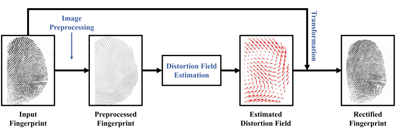
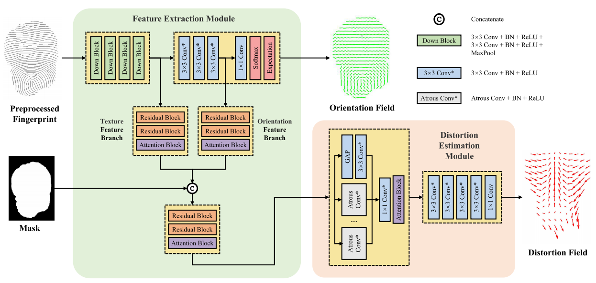

# DDRNet

<a src="https://img.shields.io/badge/cs.CV-2404.17610-b31b1b?logo=arxiv&logoColor=red" href="https://arxiv.org/abs/2404.17610"> 
    
</a> 
<a src="https://img.shields.io/badge/cs.CV-2404.17148-b31b1b?logo=arxiv&logoColor=red" href="https://arxiv.org/abs/2404.17148"> 
   
</a>

### 💬 This repo is the official implementation of:
- ***T-IFS 2023***: [Regression of Dense Distortion Field from a Single Fingerprint Image](https://arxiv.org/abs/2404.17610) 
- ***IJCB 2022***: [Direct Regression of Distortion Field from a Single Fingerprint Image](https://arxiv.org/abs/2404.17148)

[Xiongjun Guan](https://xiongjunguan.github.io/), Yongjie Duan, Jianjiang Feng, Jie Zhou

<br>

## Introduction
Skin distortion is a long standing challenge in fingerprint matching, which causes false non-matches. Previous studies have shown that the recognition rate can be improved by estimating the distortion field from a distorted fingerprint and then rectifying it into a normal fingerprint. However, existing rectification methods are based on principal component representation of distortion fields, which is not accurate and are very sensitive to finger pose. In this paper, we propose a rectification method where a self-reference based network is utilized to directly estimate the dense distortion field of distorted fingerprint instead of its low dimensional representation. This method can output accurate distortion fields of distorted fingerprints with various finger poses and distortion patterns. We conducted experiments on FVC2004 DB1\_A, expanded Tsinghua Distorted Fingerprint database (with additional distorted fingerprints in diverse finger poses and distortion patterns) and a latent fingerprint database. Experimental results demonstrate that our proposed method achieves the state-of-the-art rectification performance in terms of distortion field estimation and rectified fingerprint matching.

The overall flowchart of our proposed algorithm is shown as follows.
<br>
<p align="center">
     <br />
</p>
<br>

The structure of **DDRNet** (the name `DDR` stands for **D**ense **D**istortion field **R**egression) is shown as follows.
<br>
<p align="center">
     <br />
</p>
<br>

## :exclamation: Notice
Due to potential business cooperation, public access to this repository is restricted. Please email us to request permission if code is needed.

## News
- :bell: **[Septs. 22 2024]** Public access to this repository is restricted.
- :bell: **[May 23 2024]** Code is coming.

<br>
  

## Requirements
```shell
matplotlib==3.8.2
numpy==1.26.4
opencv_python==4.8.1.78
Pillow==10.1.0
Pillow==10.3.0
scipy==1.13.0
skimage==0.0
torch==2.1.2
torchvision==0.16.2
tqdm==4.66.1

```


## Data preparation

The file structure is as follows:
```shell
root_path/examples/
├── data_img
|   ├── 1.png
|   ├── ......
├── data_timg
|   ├── t1.png
|   ├── ......
├── data_mask
|   ├── 1.png
|   ├── ......
├── result
```

## Run
* **Inference**
    ```shell
    python inference.py
    ```

## Citation
If you find this repository useful, please give us stars and use the following BibTeX entry for citation.
```
@article{guan2023regression,
  author={Guan, Xiongjun and Duan, Yongjie and Feng, Jianjiang and Zhou, Jie},
  journal={IEEE Transactions on Information Forensics and Security}, 
  title={Regression of Dense Distortion Field From a Single Fingerprint Image}, 
  year={2023},
  volume={18},
  pages={4377-4390}}
```

```
@inproceedings{guan2022direct,
  author={Guan, Xiongjun and Duan, Yongjie and Feng, Jianjiang and Zhou, Jie},
  booktitle={2022 IEEE International Joint Conference on Biometrics (IJCB)}, 
  title={Direct Regression of Distortion Field from a Single Fingerprint Image}, 
  year={2022},
  pages={1-8}}
```


## License
This project is released under the MIT license. Please see the LICENSE file for more information.

## Contact me

If you have any questions about the code, please contact Xiongjun Guan gxj21@mails.tsinghua.edu.cn

